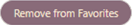

# Garden-Planner

## Description
This website is designed to help users gather information for plants to put in their gardens, It gives access to 3000 different plants. Users can use the searches to look for plants by name or location, you can also find the hardiness zone of your location. If a user doesn’t have a specific plant in mind then the browse button will allow them to look through the plant log. Favorite plants can be saved to the user’s local storage for later review. There is also a little information about gardening, to help beginners with their research. 

## Table of Contents
- [Link](#link)
- [Usage](#usage)
- [Credits](#credits)
- [Screenshots](#screenshots)
- [Future Development](#future)

## Link

[Garden-Planner](https://captianbeau.github.io/Garden-Planner/)

## Usage
The search can be used by typing in the plant you want and clicking "Search". It is recommended to not pluralize the name.
\
Click on the plant to view the information and it will appear to the left.
\
By clicking the "Save to Favorites" button it is added to the favorites page.\
\
The information will be displayed in the same way as on the results page.\
A plant can also be removed from favorites by clicking the this icon, on the favorites page.\
\
To search without a specific plant click the browse button.\
\
To search by location enter a city or zip in the "Search by Location" field and click "Search"
\

## Credits
node.js\
Perenual API\
Google geocodingAPI\
Bulma css framework\
William Rankin [wmr89](https://github.com/wmr89)\
Theron Mitchell [tronmitch](https://github.com/tronmitch)\
Adalia Lawrence [advlia](https://github.com/advlia)\
Darbie Rousseau [Captianbeau](https://github.com/Captianbeau)

## Screenshots

### Main Page
   

### Search Results Page

### Favorites Page

## Future
In furthering development we would like to add the following things:
- Refine search functionality
- Placement recommendations
- Cross pollination detection
- Recommendations for where to buy plants
- Increased number of plants to search
